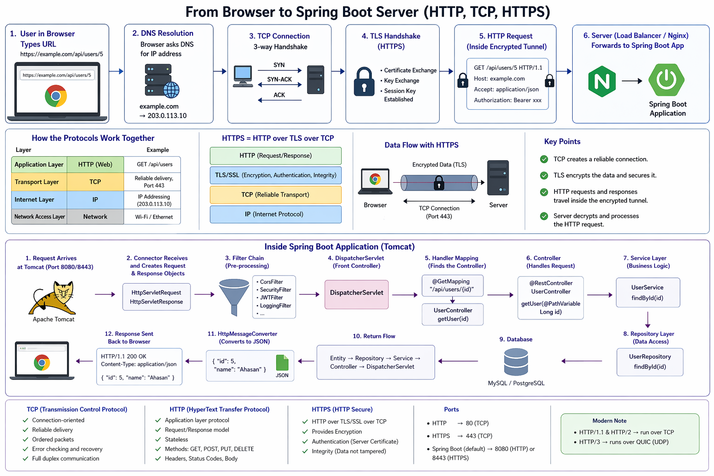

# 🚀 System Design

### 1. Networking Basics

Understand:

- HTTP / HTTPS

- TCP vs UDP

- DNS

- Load balancing basics

- **Reverse Proxy**: A **Reverse Proxy** is a server that sits in front of your backend servers and receives client requests first, then forwards them to internal servers.

  ```
  Client Browser
      ↓
  Reverse Proxy (Nginx / HAProxy / Apache / Envoy)
      ↓
  Spring Boot App / Node.js / Multiple Services
  ```



------

### 2. Backend Fundamentals

- REST API Design
- Authentication (JWT, OAuth)
- Sessions vs Tokens
- Caching basics
- Rate limiting

------

### 3. Databases

### SQL

- Indexing
- Joins
- Transactions
- ACID
- Normalization

### NoSQL

- MongoDB
- Key-Value DB
- Document DB
- CAP Theorem

### 4. Scalability

- Vertical Scaling = Bigger server
- Horizontal Scaling = More servers

###  1️⃣ Vertical Scaling (Scale Up)

**Add more power to one server.**

Examples:

```
More CPU
More RAM
Faster SSD
Better Network
```

------

### Example

Before:

```
Server:
4 CPU
8 GB RAM
```

After upgrade:

```
Server:
16 CPU
64 GB RAM
```

Same machine, stronger hardware.

------

### Diagram

```
Users
 ↓
Big Powerful Server
```

------

### Benefits

- Simple architecture
- No load balancer needed
- Easier deployment

------

### Problems

- Hardware limit exists
- Expensive at high levels
- Single point of failure
- Downtime during upgrade possible

### Horizontal Scaling (Scale Out)

**Add more servers instead of making one bigger.**

------

### Example

Before:

```
1 Server handles 1,000 users
```

After:

```
5 Servers handle 5,000+ users
```

------

### Diagram

```
Users
 ↓
Load Balancer
 ↓
Server 1
Server 2
Server 3
```

------

### Benefits

✅ Better fault tolerance
✅ High availability
✅ Can grow almost infinitely
✅ Common in cloud systems

------

### Problems

❌ More complex architecture
❌ Need load balancer
❌ Session sharing issues
❌ Data consistency challenges

## 5. Load Balancer

A **Load Balancer** distributes incoming traffic across multiple servers so no single server becomes overloaded.

- Round Robin
- Least Connections
- Sticky Session


```
Users
 ↓
Load Balancer
 ↓
App1   App2   App3
```

Used for:

- scalability
- high availability
- failover
- better performance

------

### Why Needed

Without load balancer:

```
10,000 users → One server → Crash / Slow
```

With load balancer:

```
10,000 users → Split across 3 servers
```

###  Round Robin

Requests are sent one by one in rotation.

```
Req1 → Server1
Req2 → Server2
Req3 → Server3
Req4 → Server1
Req5 → Server2
```

------

### Best For

- Similar server capacity
- Similar request sizes
- Simple web traffic

------

### Pros

✅ Easy
✅ Fair distribution
✅ Low overhead

------

### Cons

❌ Doesn't know server load
❌ Bad if one request is heavy

------

###  Least Connections

Send new request to server with **fewest active connections**.

```
Server1 = 100 active
Server2 = 20 active
Server3 = 8 active

Next request → Server3
```

------

### Best For

- Long-lived requests
- APIs with uneven request times
- WebSocket/chat systems

------

### Pros

✅ Smarter than round robin
✅ Better under mixed workloads

------

### Cons

❌ Slightly more overhead
❌ Needs live metrics

------

###  Sticky Session (Session Affinity)

Same user always goes to same server.

```
User A → Server2
User A next request → Server2 again
```

Usually based on:

- Cookie
- Source IP
- Session ID

------

### Why Needed

If sessions stored in server memory:

```
Login on Server1
Next request to Server2
Server2 doesn't know user session
```

Sticky session solves that.

------

### Pros

✅ Easy for session-based apps
✅ No shared session store needed initially

------

### Cons

❌ Uneven load possible
❌ If server dies, user loses session
❌ Harder to scale

------

### Better Alternative to Sticky Session

Use shared session store:

```
Redis + Spring Session
```

### Example

```
Server1 busy with report generation
But still gets next request
```

###  6. Caching

- Redis
- CDN
- Browser cache
- Cache Invalidation

------

###  7. Messaging Systems

- RabbitMQ = Task Queue
- Kafka = Event Streaming

Understand:

- Queue
- Producer/Consumer
- Retry
- Dead Letter Queue

## 8. Consistency Concepts

- Replication
- Sharding
- Partitioning
- Eventual Consistency
- Strong Consistency

## 9. Failure Handling

- Circuit Breaker
- Retry Pattern
- Timeout
- Fallback

## 10. Distributed Transactions

- Saga Pattern
- 2PC

## 11. Microservices

- API Gateway
- Service Discovery
- Inter-service Communication

## 12. Observability

- Logs
- Metrics
- Traces

Use:

- Prometheus
- Grafana
- ELK
- OpenTelemetry

------

# 📌Real World Designs

Practice designing:

### Beginner

- URL Shortener
- Parking System
- Notification System

### Intermediate

- Chat App
- Food Delivery
- Ride Sharing
- E-commerce

### Advanced

- YouTube
- Netflix
- Uber
- Facebook Feed

------

### 📌 Interview Trick

Whenever asked system design:

Always discuss:

1. Requirements
2. Scale estimation
3. DB choice
4. APIs
5. High level design
6. Bottleneck
7. Scaling
8. Security
9. Monitoring

------

### 📌 Senior Engineer / Remote Job

Master these first:

✅ Cache
✅ Kafka
✅ DB indexing
✅ Microservices
✅ Docker
✅ Kubernetes
✅ AWS basics

